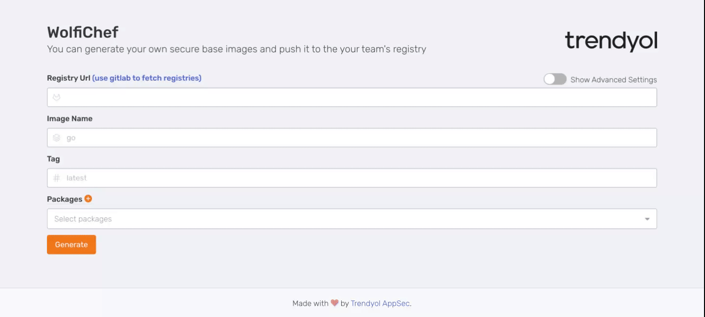

# WolfiChef


WolfiChef is an open-source application that allows users to create secure base images using packages from the Wolfi OS. This application takes basic information such as registry URL, image name, and image tag from the user and builds Docker images with customizable additional options.



## Features

- User-friendly interface for easy usage
- Building base images with packages from the Wolfi OS APK library
- Optional customization options during the image creation process
- Advanced security and package management
- Gitlab Registry Integration
- Static Presets to easily create images
- Check vulnerabilities of generated images with Trivy

## Getting Started

These instructions will guide you to clone and set up the project on a local machine for development and testing purposes. To use a released version, follow the instructions under the "Usage" section.

### Requirements

- Node.js and yarn (To manage project dependencies for the frontend)
- Golang (To run the backend server)

### Frontend Installation

1. Clone frontend repository to your local machine:
```shell
git clone https://github.com/trendyol/wolfichef-fe.git
```
2. Navigate to the frontend directory:
```shell
cd wolfichef-fe
```
3. Install the dependencies:
```shell
yarn 
```
4. Start the frontend application:
```shell
yarn run dev
```
The frontend application should now be running at http://localhost:5713.

### Backend Installation

1. Clone backend repository to your local machine:
```shell
git clone https://github.com/trendyol/wolfichef.git
```
2. Navigate to the backend directory:
```shell
cd wolfichef
```
3. Create a new `config.yml` file by copying the `config.sample.yml`:
```shell
cp configs/config.sample.yml configs/config.yml 
```
4. Open the `config.yml` file and fill in the necessary information, such as API keys, database credentials, and any other configurations required for your environment.
5. Build the Golang binary:
```shell
go build -gccgoflags "-s -w" -o wolfichef
```
6. Start the backend server:
```shell
./wolfichef
```

The backend server should now be running at http://localhost:8000.

## Usage

1. After starting both the frontend and backend applications, open http://localhost:5713 in your web browser.

2. Enter the required information: Registry URL, Image Name, and Image Tag.

3. Customize optional settings such as the current working directory, entrypoint, and environments, if needed.

4. Select the desired package from the Wolfi OS APK library.

5. Click on the "Build Image" button to create the secure base image.

## Contributing

We welcome contributions to improve the WolfiChef. To contribute, please follow these steps:

1. Fork the repository.

2. Create your feature branch.

3. Open a pull request with a detailed description of the changes.

## License

This project is licensed under the [MIT License](LICENSE).